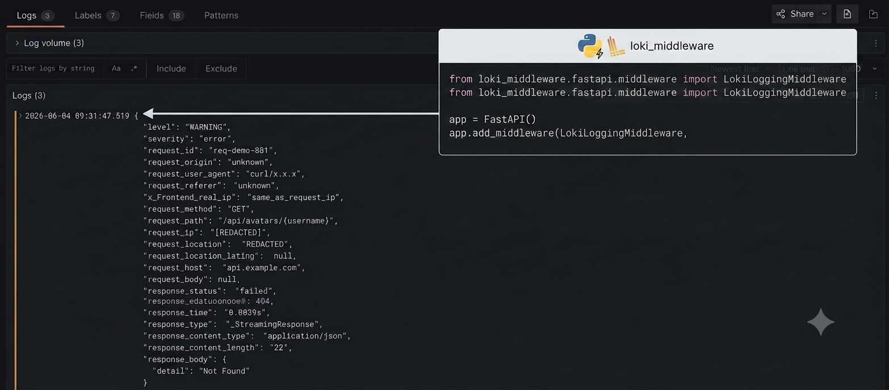

# loki-middleware


[](https://www.python.org/downloads/)
[](https://opensource.org/licenses/MIT)
[](https://pypi.org/project/loki-middleware/)

**Structured logging middleware for FastAPI with Loki integration.**

Middleware that captures detailed HTTP request/response data and geolocation, sending structured logs to Loki for visualization in Grafana. OpenTelemetry / distributed-tracing correlation is currently a placeholder and requires additional configuration in the application (see notes below).

## 🎯 Features

- ✅ **Structured JSON Logging** - Machine-readable logs with consistent schema
- ✅ **Loki Integration** - Direct push to Grafana Loki for log aggregation
- ✅ **Distributed Tracing (partial)** - trace/span correlation is a placeholder; full OpenTelemetry extraction requires configuring OpenTelemetry in your app and is not yet fully implemented in the middleware
- ✅ **Geolocation** - Automatic IP geolocation (city, country, coordinates)
- ✅ **Request/Response Capture** - Full body logging with content-type handling
- ✅ **Multiple Frameworks** - FastAPI (current). Django integration is planned.
- ✅ **Performance Metrics** - Request execution time tracking
- ✅ **Error Handling** - Graceful degradation and error alerting
- ✅ **Customizable** - Exclude paths, configure tags, adjust formatters
- ✅ **Production Ready** - Error recovery, client disconnect handling

## 📦 Installation

```bash
pip install loki-middleware
```

### Optional: With Django support (coming soon)
```bash
pip install loki-middleware[django]
```

### Development dependencies
```bash
pip install loki-middleware[dev]
```

## 🚀 Quick Start

### FastAPI Setup

```python
from fastapi import FastAPI
from loki_middleware.fastapi.middleware import LokiLoggingMiddleware

app = FastAPI()

# Add middleware (current API)
app.add_middleware(
    LokiLoggingMiddleware,
    exclude_paths=["/health", "/metrics"]
)

@app.get("/")
async def root():
    return {"message": "Hello World"}
```

## ⚙️ Configuration

### Environment Variables

```bash
# Loki server (full URL, e.g. http://127.0.0.1:3100/loki/api/v1/push)
LOKI_URL=http://127.0.0.1:3100/loki/api/v1/push

# Application metadata (used as static tags)
LOKI_APPLICATION=my-app
LOKI_ENVIRONMENT=production
LOKI_SERVICE=backend

# Optional request host override used by the middleware
REQUEST_HOST=api.example.com

# Optional: comma-separated sensitive fields to redact
LOKI_SENSITIVE_FIELDS=password,token,authorization
LOKI_MASK_VALUE=********
```

### Configuration Notes

The repository does not currently expose a `LokiConfig` class. The middleware accepts the following runtime option when added to FastAPI:

- `exclude_paths` (list): paths to ignore (default includes `/health`, `/metrics`, `/docs`)

Application / Loki connection metadata is read from environment variables (see the section above). A `LokiConfig` helper/constructor may be added in a future release.

## 📊 Logged Data

### Request Information
```json
{
  "request_id": "550e8400-e29b-41d4-a716-446655440000",
  "request_method": "POST",
  "request_path": "/api/users?page=1",
  "request_ip": "192.168.1.100",
  "request_host": "api.example.com",
  "request_origin": "https://app.example.com",
  "request_user_agent": "Mozilla/5.0...",
  "request_body": { "name": "John", "email": "john@example.com" },
  "request_location": "Paris, Île-de-France, France",
  "request_location_latlng": [48.8566, 2.3522]
}
```

### Response Information
```json
{
  "response_status": "successful",
  "response_status_code": 201,
  "response_time": "0.1234s",
  "response_type": "JSONResponse",
  "response_content_type": "application/json",
  "response_body": { "id": 123, "name": "John" }
}
```

### Distributed Tracing

The middleware contains a placeholder for extracting OpenTelemetry trace/span context, but this is not yet active. If you configure OpenTelemetry in your app the trace/span may be available — full automatic correlation is planned in a follow-up release.

## 🔍 Query Examples in Grafana

### All errors in production
```logql
{service="backend", environment="production"} | json | severity="error"
```

### Slow requests (>1s)
```logql
{application="my-api"} | json | response_time > 1s
```

### Failed API calls
```logql
{service="backend"} | json | response_status_code >= 400
```

### By specific user location
```logql
{application="my-api"} | json | request_location=~"Paris.*"
```

## 📈 Performance Considerations

- **Geolocation caching**: Consider implementing Redis caching for IP lookups
- **Body size limits**: Large response bodies are truncated at ~1000 chars by the middleware; request bodies are currently captured fully (consider adding a request-size limit if needed)
- **Streaming responses**: Handled by consuming and rebuilding the iterator; review memory implications for very large streams
- **Client disconnections**: Gracefully handled without errors

## 🛠 Advanced Usage

### Custom Exclude Paths

```python
config = LokiConfig(
    exclude_paths=[
        "/health",
        "/metrics",
        "/static",
        "/admin"
    ]
)
```

### OpenTelemetry Integration

OpenTelemetry correlation is currently a placeholder in the middleware (there are commented sections in the code). To get full trace/span correlation you should configure OpenTelemetry in your application and a follow-up release will add automatic extraction and enrichment of trace IDs.

## 📋 Planned Features

- [ ] Django middleware
- [ ] FastAPI dependency injection helper
- [ ] Response time percentile tracking
- [ ] `LokiConfig` helper/constructor and public API for runtime configuration
- [ ] Improved OpenTelemetry automatic correlation

## 🧪 Testing

```bash
pytest tests/
pytest tests/test_fastapi.py -v
pytest tests/test_django.py -v
```

## 🤝 Contributing

Contributions welcome! Please:
1. Fork the repository
2. Create a feature branch
3. Add tests
4. Submit a pull request

## 📄 License

MIT License - see [LICENSE](LICENSE) file for details

## 🙏 Acknowledgments

- [Loki](https://grafana.com/oss/loki/) - Log aggregation system
- [FastAPI](https://fastapi.tiangolo.com/) - Web framework
- [OpenTelemetry](https://opentelemetry.io/) - Distributed tracing

## 📞 Support

- **Issues**: [GitHub Issues](https://github.com/IlemLembo/loki-middleware/issues)
- **Email**: lemboilem@gmail.com
- **Docs**: [Full Documentation](https://github.com/IlemLembo/loki-middleware/wiki)

---

**Made with ❤️ for better observability**